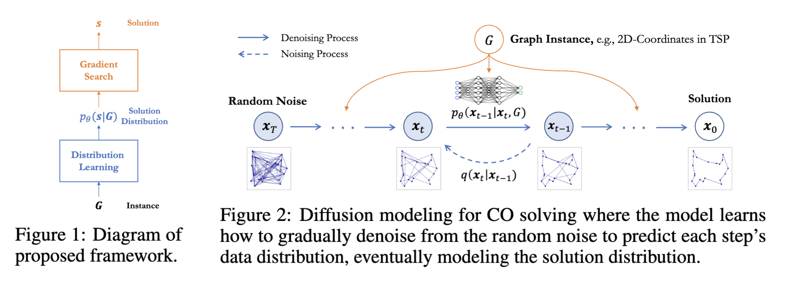
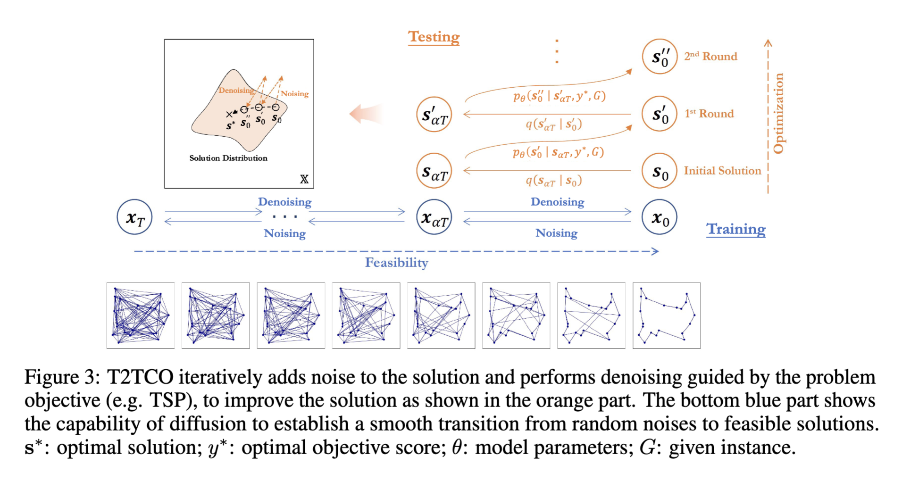

# T2TCO: From Distribution Learning in Training to Gradient Search in Testing for Combinatorial Optimization

Official implementation of **NeurIPS 2023** paper: "[From Distribution Learning in Training to Gradient Search in Testing for Combinatorial Optimization](https://www.researchgate.net/publication/375239515_From_Distribution_Learning_in_Training_to_Gradient_Search_in_Testing_for_Combinatorial_Optimization)".

Authors: Yang Li, Jinpei Guo, Runzhong Wang, Junchi Yan.





**Abstract:** Extensive experiments have gradually revealed the potential performance bottleneck of modeling Combinatorial Optimization (CO) solving as neural solution prediction tasks. The neural networks, in their pursuit of minimizing the average objective score across the distribution of historical problem instances, diverge from the core target of CO of seeking optimal solutions for every test instance. This calls for an effective search on each problem instance, while the model should serve to provide supporting knowledge that benefits the search. To this end, we propose T2TCO (Training to Testing) framework  that first leverages the generative modeling to estimate the high-quality solution distribution for each instance during training, and then conducts a gradient-based search within the solution space during testing. The proposed neural search paradigm consistently leverages generative modeling, specifically diffusion, for graduated solution improvement. It disrupts the local structure of the given solution by introducing noise and reconstructs a lower-cost solution guided by the optimization objective.  Experimental results on Traveling Salesman Problem (TSP) and Maximal Independent Set (MIS) show the significant superiority of T2TCO, demonstrating an average performance gain of 49.15% for TSP solving and 17.27% for MIS solving compared to the previous state-of-the-art.

## Setup

The implementation is primarily developed on top of [DIFUSCO](https://github.com/Edward-Sun/DIFUSCO)'s code foundation.

```bash
conda env create -f environment.yml
conda activate t2tco
```

Running TSP experiments requires installing the additional cython package for merging the diffusion heatmap results:

```bash
cd diffusion/utils/cython_merge
python setup.py build_ext --inplace
cd -
```

## Data and Pretrained Checkpoints

We provide the evaluation data for TSP in `data/tsp`. For other details, please refer to `data` folder. Please download the pretrained model checkpoints from [here](https://drive.google.com/drive/folders/1IjaWtkqTAs7lwtFZ24lTRspE0h1N6sBH?usp=sharing).

## Reproduction

Please refer to [DIFUSCO](https://github.com/Edward-Sun/DIFUSCO) for the training process. Evaluation scripts can be directly found in `scripts` folder.

Evaluation can be simply conducted through:

```bash
# TSP
bash tsp50.sh  # evaluate on 50-node TSP instances
bash tsp100.sh  # evaluate on 100-node TSP instances
bash tsp500.sh  # evaluate on 500-node TSP instances
bash tsp1000.sh  # evaluate on 1000-node TSP instances
bash tsplib50-200.sh  # evaluate on TSPLIB instances with 50-200 nodes
bash tsplib200-1000.sh  # evaluate on TSPLIB instances with 200-1000 nodes

# MIS
bash mis_er.sh  # evaluate on ER instances
bash mis_satlib.sh  # evaluate on SATLIB instances
```

For instance, a simple run of T2TCO on TSP50 data:

```bash
export PYTHONPATH="$PWD:$PYTHONPATH"
export CUDA_VISIBLE_DEVICES=0,1,2,3

python -u diffusion/train.py \
  --task "tsp" \
  --wandb_logger_name "tsp50" \
  --storage_path "./" \
  --validation_split "data/tsp/tsp50_concorde.txt" \
  --test_split "data/tsp/tsp50_concorde.txt" \
  --validation_examples 8 \
  --inference_schedule "cosine" \
  --inference_diffusion_steps 50 \
  --two_opt_iterations 1000 \
  --resume_weight_only \
  --ckpt_path "ckpts/tsp50_categorical.ckpt" \
  --parallel_sampling 1 \
  --rewrite_ratio 0.25 \
  --norm \
  --rewrite
```

## Reference

If you found this codebase useful, please consider citing the paper:

```
@inproceedings{li2023t2tco,
  title = {From Distribution Learning in Training to Gradient Search in Testing for Combinatorial Optimization},
  author = {Li, Yang and Guo, Jinpei and Wang, Runzhong and Yan, Junchi},
  booktitle = {Advances in Neural Information Processing Systems},
  year = {2023}
}
```
